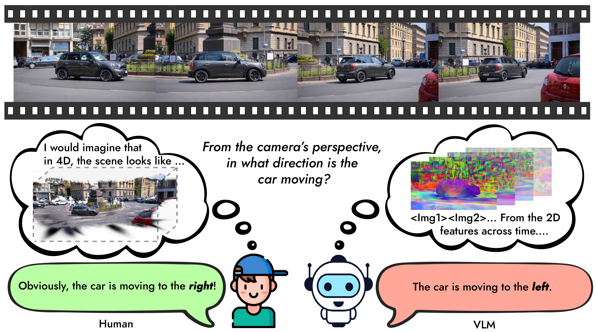

# VLM4D: Towards Spatiotemporal Awareness in Vision Language Models

[Shijie Zhou*](https://ShijieZhou-UCLA.github.io/)<sup>1</sup>, [Alexander Vilesov*](https://asvilesov.github.io/)<sup>1</sup>, [Xuehai He*](https://sheehan1230.github.io/)<sup>2,3</sup>, [Ziyu Wan](http://raywzy.com/)<sup>2</sup>, [Shuwang Zhang](https://www.linkedin.com/in/shuwang-zhang/)<sup>1</sup>, [Aditya Nagachandra](https://adityanagachandra.github.io/)<sup>1</sup>, [Di Chang](https://boese0601.github.io/)<sup>3</sup>, [Dongdong Chen](https://www.dongdongchen.bid/)<sup>2</sup>, [Xin Eric Wang](https://eric-xw.github.io/)<sup>3</sup>, [Achuta Kadambi](https://samueli.ucla.edu/people/achuta-kadambi/)<sup>1</sup>

<sup>1</sup>UCLA, <sup>2</sup>Microsoft, <sup>3</sup>UCSC, <sup>4</sup>USC


<a href='https://arxiv.org/abs/2508.02095v2'></a> <a href='https://vlm4d.github.io/'></a> <a href='https://vlm4d.github.io/#leaderboard'></a> <a href='https://huggingface.co/datasets/shijiezhou/VLM4D'></a> <a href=''></a>




## TODO
- [x] Release dataset
- [x] Release evaluation code  
<!-- - [ ] EvalAI server setup -->

<!-- ## :fire: News -->
<!-- * **[2025.07.14]** We integrate the benchmark into [AGI-Eval](https://agi-eval.cn/evaluation/detail?id=66) platform. More models and results will be updated there. -->


## Dataset Structure
The dataset can be downloaded from Hugging Face.
Each entry in the dataset contains the following fields:
- `id`: Unique identifier for each evaluation question
- `video`: Hugging Face URL of the video
- `question_type`: We use the objective question type "multiple-choice" 
- `question`: The question
- `choices`: 4 choices for the multiple-choice question
- `answer`: Ground-truth answer to the question


## Example Entry

```json
[
    {
        "id": "validation_160",
        "video": "https://huggingface.co/datasets/shijiezhou/VLM4D/resolve/main/videos_real/davis/city-ride.mp4",
        "question_type": "multiple-choice",
        "question": "From the camera perspective, which direction are the cyclists moving toward?",
        "choices": {
            "A": "not moving",
            "B": "left",
            "C": "right",
            "D": "backwards"
        },
        "answer": "left"
    }
]
```


## Evaluation

### 1. Setup
Install the required packages:
```bash
pip install -r requirements/requirements.txt
```

### 2. Response Generation
Run the scripts under `model_inference_scripts`, for example:
```bash
bash model_inference_scripts/run_vllm_video_models.sh 
```

The model outputs are saved in the `outputs/{data_type}_{prompt}` directory, where:

- `{data_type}`  
  - `real_mc`: multiple-choice answers on real video data  
  - `synthetic_mc`: multiple-choice answers on synthetic video data  

- `{prompt}`  
  - `cot`: chain-of-thought reasoning  
  - `direct-output`: direct answers without intermediate reasoning steps  


### 3. Evaluation
To evaluate the generated responses, run the following command:
```bash
python acc_evaluation.py --output_dir outputs/real_mc_cot
```

The evaluation results are saved in the `outputs/processed_outputs/` directory. 

As illustrated in our paper, the LLM-as-judge may occasionally make mistakes. To address this, we also provide manually verified evaluation results, obtained by cross-checking the outputs of two LLM judges (OpenAI o3 and o4-mini), which can be found in `processed_outputs/o4mini_verified/`.


Finally, run the following command to generate the statistics of the evaluation results:
```bash
python acc_final_statistics.py
```
Where you are free to set the output folders inside.


## License Agreement
Please refer to [LICENSE](./LICENSE.md).
All videos of the VLM4D benchmark are obtained from the public research video datasets ([DAVIS](https://davischallenge.org/), [YouTube-VOS](https://youtube-vos.org/), [Ego4D](https://ego4d-data.org/)) which are not property of our institutions. The copyright remains with the original owners of the video. This repo is developed based on the evaluation framework of [MMVU](https://github.com/yale-nlp/MMVU), many thanks to the authors for opensoucing the codebase.


## Citation
```
@inproceedings{zhou2025vlm4d,
    title={VLM4D: Towards Spatiotemporal Awareness in Vision Language Models},
    author={Zhou, Shijie and Vilesov, Alexander and He, Xuehai and Wan, Ziyu and Zhang, Shuwang and Nagachandra, Aditya and Chang, Di and Chen, Dongdong and Wang, Eric Xin and Kadambi, Achuta},
    booktitle={Proceedings of the IEEE/CVF international conference on computer vision},
    year={2025}
}
```